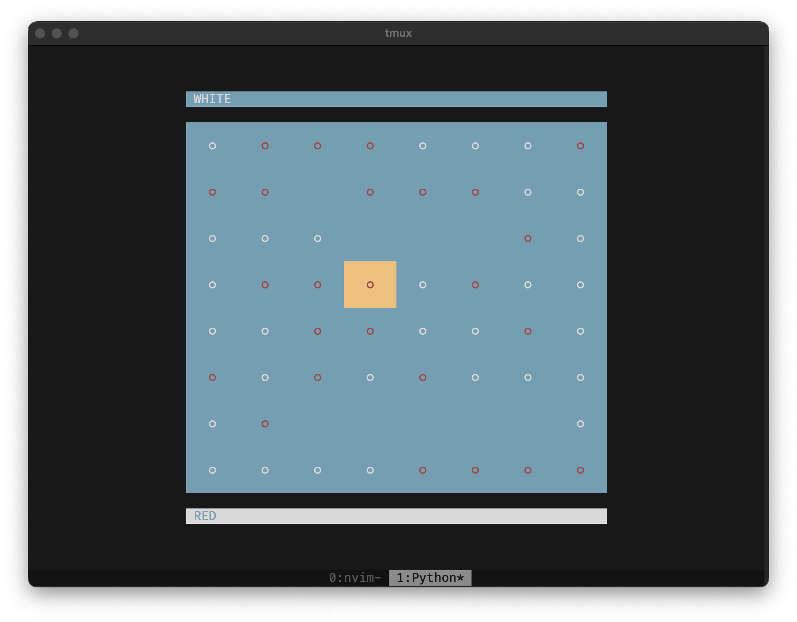

# Overboard Boardgame

A TUI implementation of the Overboard boardgame. The goal with this project is to train a agent to play this game. So far it only has a min-max solver.

## Game rules

- Two players start the game by picking their color (white or red).
- The players take turns moving the pieces. Each player can only touch the pieces of their color.
- The goal is to slide your pieces on the board (horizontally or vertically) to push off your opponents pieces.
- You can not push over your own pieces.
- If your move does not push over any pieces then you can only move one unit.

# Controls

- ``Arrow keys`` to move to select
- ``Spacebar`` to select piece
- ``Arrow keys`` to move piece
- ``Enter`` to make move
- ``q`` to quit
